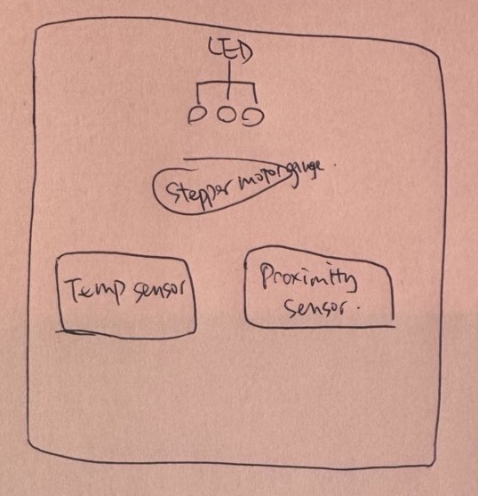
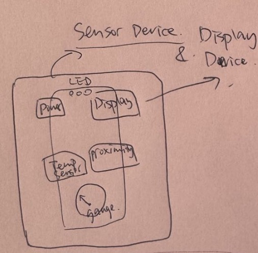
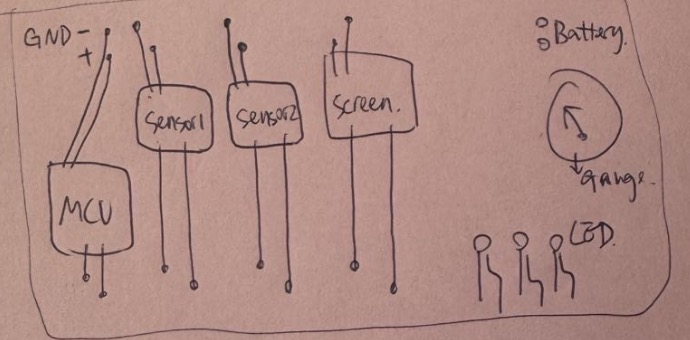
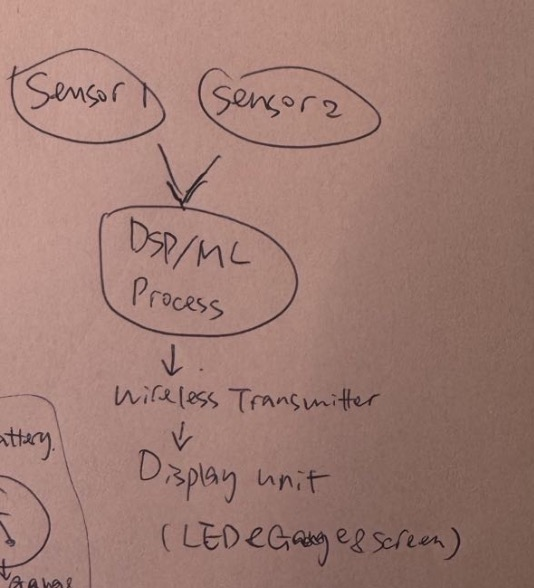
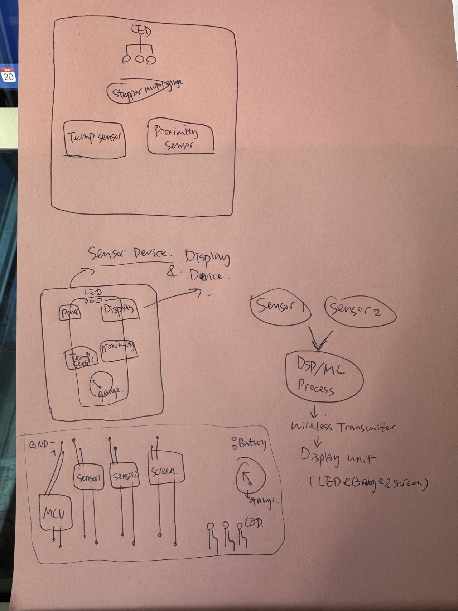

# Final_514

1. Overview
   Title: Social Distancing Device
   Description: This device helps maintain safe social distancing by monitoring the surrounding temperature and proximity. It uses sensors to collect real-time data and displays alerts via LEDs and a stepper-motor-driven gauge. The device is compact, wearable, and designed for easy use.
 
2. Sensor Device
   The sensor unit measures temperature and proximity. A proximity sensor identifies objects or people within a defined radius, while the temperature sensor detects environmental temperature changes to infer crowd density. Data is filtered using DSP algorithms for accuracy and transmitted wirelessly.
   Proximity Sensor: Measures the distance of nearby objects or individuals.
   Temperature Sensor: Detects environmental temperature changes to infer crowd density.
   DSP/ML Algorithm Processor: Filters and processes sensor data using techniques like moving averages to smooth noise.
   Wireless Transmitter: Sends processed data to the display unit via Bluetooth or another wireless communication protocol.
 

3. Display Device
   The display unit consists of an LED system and a needle gauge powered by a stepper motor. The LEDs change color based on proximity (green: safe, yellow: caution, red: too close), while the gauge dynamically shows real-time distance readings.
   RGB LED System: Indicates proximity thresholds:
   Green for "safe distance."
   Yellow for "caution zone."
   Red for "too close."
   Stepper Motor Needle Gauge: Displays proximity levels dynamically in real-time.
   Power Source: A LiPo battery powers the entire display system.
 

4. Communication System and Workflow
   The sensor unit transmits data wirelessly to the display unit via Bluetooth or similar technology. The system ensures seamless real-time updates.
   Data flow:
   Sensor readings (proximity and temperature) are captured and processed in the DSP unit.
   The wireless transmitter sends this processed data to the display unit.
   The display unit interprets the data and activates the corresponding LEDs and gauge to provide clear visual feedback.
    

   
